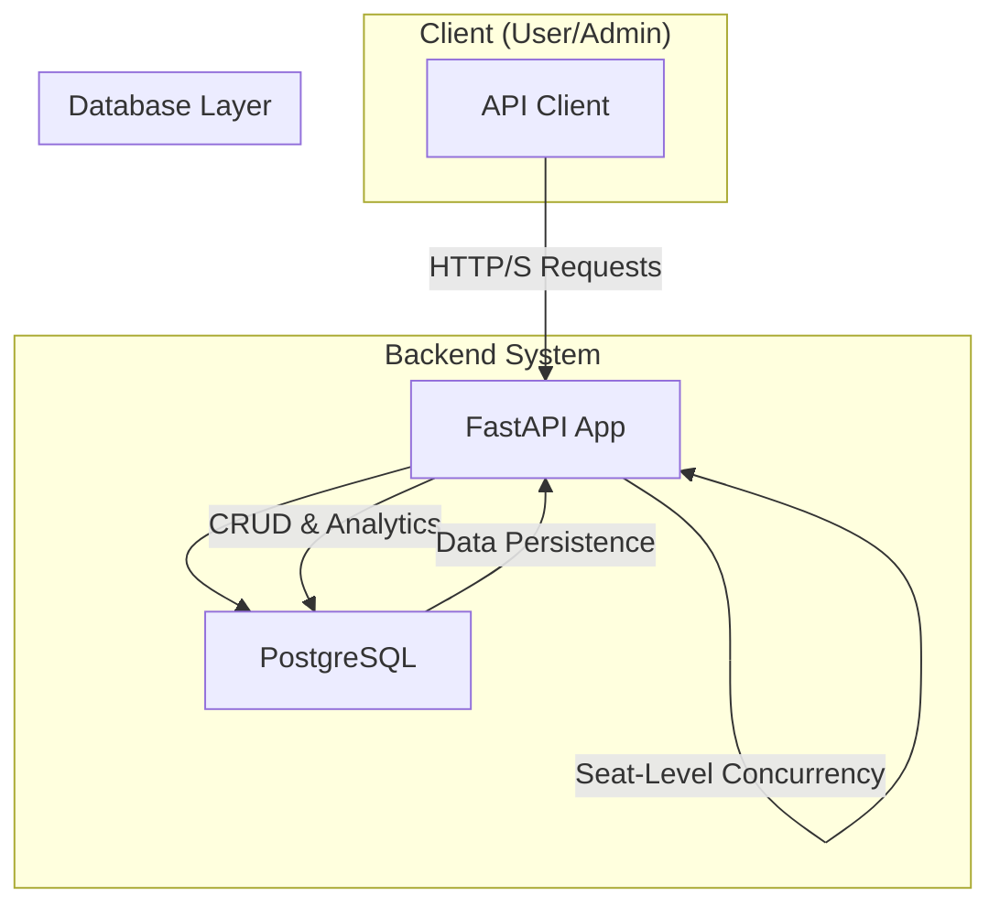
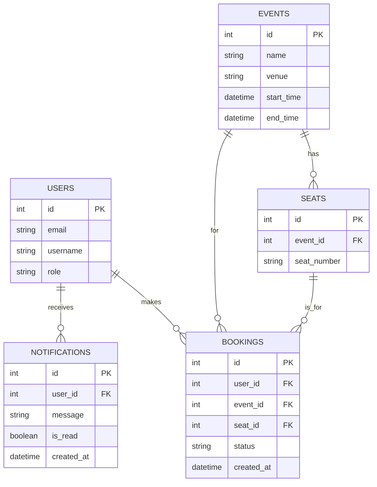

# Evently API

Evently is a scalable backend system for an event ticketing platform. It provides a RESTful API for users to browse events and manage bookings, and for admins to manage events and view analytics.

This project is built with a focus on concurrency handling, scalability, and clean API design. It includes core features as well as advanced enhancements like a fully-featured waitlist and notification system, advanced analytics, and seat-level booking.

## Table of Contents
- [High-Level Architecture](#high-level-architecture)
- [Entity-Relationship (ER) Diagram](#entity-relationship-er-diagram)
- [Major Design Decisions](#major-design-decisions)
- [Getting Started](#getting-started)
- [API Documentation & Walkthrough](#api-documentation--walkthrough)

## High-Level Architecture

The system is designed as a containerized application using Docker. It consists of a FastAPI application server and a PostgreSQL database.



- **API Client**: Any HTTP client (like a frontend application, mobile app, or curl) that interacts with the API.
- **FastAPI App**: The core of the backend, handling all business logic, API routing, and data validation.
- **Seat-Level Concurrency**: Implemented within the FastAPI app at the service layer. To prevent race conditions, a pessimistic lock (SELECT FOR UPDATE) is placed on an individual Seat row during a booking attempt.
- **PostgreSQL Database**: A robust relational database used for data persistence and ensuring transactional integrity.

## Entity-Relationship (ER) Diagram

The database schema supports users, events, seats, bookings, and notifications.



## Major Design Decisions

- **Framework**: FastAPI was chosen for its high performance, asynchronous capabilities, and automatic generation of OpenAPI documentation.
- **Database**: PostgreSQL was selected due to its robustness, support for advanced SQL features like SELECT FOR UPDATE, and strong transactional guarantees.
- **Concurrency Handling**: With the implementation of seat-level booking, the concurrency strategy shifted. A pessimistic lock using SELECT FOR UPDATE is now applied to the specific Seat row being booked. This is a more granular and highly scalable approach compared to locking the entire event, as it allows multiple users to book different seats for the same event simultaneously without conflict.
- **Seat & Booking Management**: The concept of capacity was replaced by a dedicated Seat table. An event's capacity is the count of its associated seats. A booking is now tied to a specific seat, and a seat's availability is determined by checking for an active booking associated with it. This allows for features like re-booking a seat after a cancellation.
- **Analytics & Soft Deletes**: To support advanced analytics like cancellation rates, bookings are soft-deleted. Instead of being removed from the database, a booking's status is changed from active to cancelled. This preserves historical data for accurate reporting.
- **Containerization**: The entire application is containerized using Docker and orchestrated with Docker Compose for a consistent and reproducible environment.
- **Testing**: The application is tested using Pytest. An in-memory SQLite database is used for speed. Dialect-specific logic is used in the application and tests to handle differences between SQLite and PostgreSQL, ensuring the test suite can run effectively while the production code remains robust for PostgreSQL.

## Getting Started

### Prerequisites
- Docker
- Docker Compose

### Running the Application

1. Clone the repository:
   ```bash
   git clone <repository-url>
   cd <repository-name>
   ```

2. Build and run the services:
   ```bash
   docker-compose up --build -d
   ```

3. The API will be available at `http://localhost:8000`.

4. Apply Database Migrations: Run all Alembic migration scripts to build the full database schema.
   ```bash
   docker-compose exec api alembic upgrade head
   ```

5. Seed the Database (Optional): To populate the database with sample users and events (with seats), run the seed script.
   ```bash
   docker-compose exec api python seed.py
   ```

## API Documentation & Walkthrough

### Authentication

This API uses a simple, header-based mechanism for identifying users and their roles.

- `X-User-ID`: An integer representing the user's ID. Required for user-specific endpoints.
- `X-User-Role`: A string, admin. Required for admin-only endpoints.

Sample Users (from seed script):
- **Regular User**: `X-User-ID: 1`
- **Admin User**: `X-User-ID: 2`, `X-User-Role: admin`

### User Endpoints

#### 1. List All Events
- **Endpoint**: `GET /events`
- **Description**: Retrieves a list of all events and their available seats.
- **curl Example**: 
  ```bash
  curl -X GET "http://localhost:8000/events"
  ```

#### 2. Book an Event
- **Endpoint**: `POST /bookings`
- **Description**: Books an available seat for a given event. If the event is full, the user is automatically added to the waitlist.
- **curl Example**:
  ```bash
  curl -X POST "http://localhost:8000/bookings" \
      -H "Content-Type: application/json" \
      -d '{
    "user_id": 1,
    "event_id": 1
  }'
  ```

#### 3. View My Bookings
- **Endpoint**: `GET /users/me/bookings`
- **Description**: Retrieves the active booking history for the current user.
- **curl Example**: 
  ```bash
  curl -X GET "http://localhost:8000/users/me/bookings" -H "X-User-ID: 1"
  ```

#### 4. Cancel a Booking
- **Endpoint**: `DELETE /bookings/{booking_id}`
- **Description**: Cancels a specific booking, making the seat available again.
- **curl Example**: 
  ```bash
  curl -X DELETE "http://localhost:8000/bookings/1" -H "X-User-ID: 1"
  ```

#### 5. View My Notifications
- **Endpoint**: `GET /users/me/notifications`
- **Description**: Retrieves all notifications for the current user, such as alerts for open spots from a waitlist.
- **curl Example**: 
  ```bash
  curl -X GET "http://localhost:8000/users/me/notifications" -H "X-User-ID: 1"
  ```

#### 6. View My Waitlist Entries
- **Endpoint**: `GET /waitlists/me`
- **Description**: Retrieves a list of all events the current user is waitlisted for.
- **curl Example**: 
  ```bash
  curl -X GET "http://localhost:8000/waitlists/me" -H "X-User-ID: 1"
  ```

#### 7. Leave a Waitlist
- **Endpoint**: `DELETE /waitlists/{waitlist_entry_id}`
- **Description**: Removes the user from a specific waitlist.
- **curl Example**: 
  ```bash
  curl -X DELETE "http://localhost:8000/waitlists/1" -H "X-User-ID: 1"
  ```

### Admin Endpoints

All admin endpoints require the header `X-User-Role: admin`.

#### 1. Create an Event
- **Endpoint**: `POST /admin/events`
- **Description**: Creates a new event and generates the specified number of seats for it.
- **curl Example**:
  ```bash
  curl -X POST "http://localhost:8000/admin/events" \
      -H "Content-Type: application/json" -H "X-User-Role: admin" \
      -d '{
    "name": "Exclusive Gala",
    "venue": "The Grand Hall",
    "start_time": "2026-07-01T19:00:00",
    "end_time": "2026-07-01T23:00:00",
    "total_seats": 50
  }'
  ```

#### 2. Update an Event
- **Endpoint**: `PUT /admin/events/{event_id}`
- **Description**: Updates an event's details. Note: does not support changing the number of seats after creation.
- **curl Example**:
  ```bash
  curl -X PUT "http://localhost:8000/admin/events/1" \
      -H "Content-Type: application/json" -H "X-User-Role: admin" \
      -d '{
    "name": "Renamed Gala",
    "venue": "The Grand Hall",
    "start_time": "2026-07-01T19:00:00",
    "end_time": "2026-07-01T23:30:00",
    "total_seats": 50
  }'
  ```

#### 3. Delete an Event
- **Endpoint**: `DELETE /admin/events/{event_id}`
- **Description**: Deletes an event and all its associated seats and bookings. Fails if the event has any active bookings.
- **curl Example**: 
  ```bash
  curl -X DELETE "http://localhost:8000/admin/events/3" -H "X-User-Role: admin"
  ```

#### 4. View System Analytics
- **Endpoint**: `GET /admin/analytics`
- **Description**: Retrieves advanced analytics, including booking totals, cancellation rates, daily stats, and seat utilization per event.
- **curl Example**: 
  ```bash
  curl -X GET "http://localhost:8000/admin/analytics" -H "X-User-Role: admin"
  ```
